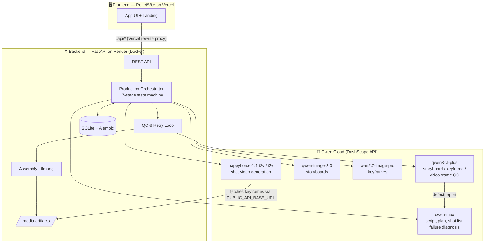

# cre8motion 🎬

**An AI Showrunner that autonomously produces short animated drama episodes — from a one-line premise to a finished, assembled video — built on Qwen Cloud.**

**Live demo:** https://cre8motion.vercel.app
**API:** https://cre8motion.onrender.com/health

Built for the Global AI Hackathon with Qwen Cloud — **Track 2: AI Showrunner**.

## What it does

You give cre8motion a show premise and characters. Its autonomous production pipeline then handles the entire creation process the way a real studio would — writing, planning, storyboarding, shooting, quality control, and editing — with no human in the loop (though you can pause and review at every stage):

1. **Script & episode planning** — story beats, pacing, and a full shot list
2. **Storyboards** — one frame per shot to lock composition
3. **Keyframes** — high-quality character-consistent stills
4. **Video generation** — each shot animated from its keyframe
5. **Automated QC** — a vision model reviews every artifact and triggers targeted retries with diagnosed fixes
6. **Audio & assembly** — sound cues and final episode stitching (ffmpeg)

## Architecture



### The agentic loop (what makes it a Showrunner, not a generator)

The orchestrator (`backend/app/services/orchestrator.py`) drives a validated state machine:

`NORMALIZING_INPUT → PLANNING → PLAN_VALIDATION → REFERENCE_RESOLUTION → SHOT_PLANNING → STORYBOARD_GENERATION → STORYBOARD_QC → KEYFRAME_GENERATION → KEYFRAME_QC → VIDEO_GENERATION → VIDEO_QC → AUDIO_GENERATION → ASSEMBLY → FINAL_QC → READY_FOR_REVIEW`

After each generation stage, **qwen3-vl-plus** inspects the output against the shot spec (composition, character consistency, continuity locks). Failures are sent to **qwen-max** for diagnosis, which rewrites the prompt for a targeted retry — an autonomous generate → critique → repair loop at every stage of production.

## Qwen Cloud usage (proof for judges)

All Alibaba Cloud / Qwen API integration lives in one file:
**[`backend/app/providers/qwen.py`](backend/app/providers/qwen.py)** — via the DashScope endpoint (`dashscope-intl.aliyuncs.com`).

| Provider class | Model | Role |
|---|---|---|
| `QwenReasoningProvider` | `qwen-max` | Scripts, episode plans, shot lists, show proposals, failure diagnosis |
| `QwenVisionProvider` | `qwen3-vl-plus` | Automated QC of storyboards, keyframes, and video frames |
| `QwenImageProvider` | `qwen-image-2.0`, `wan2.7-image-pro` | Storyboards and keyframes |
| `QwenVideoProvider` | `happyhorse-1.1-t2v / -i2v` | Text-to-video and image-to-video shot generation |
| `QwenAudioProvider` | — | Audio cue generation |

## Repository structure

| Folder | What it is |
|---|---|
| `frontend/` | React + Vite + TypeScript app (landing page + production workspace) |
| `backend/` | FastAPI + SQLAlchemy + Alembic API and orchestrator |
| `landing/` | Earlier standalone landing page (superseded — kept for reference) |

## Running locally

### Backend
```bash
cd backend
python -m venv venv
venv/Scripts/activate   # Windows (source venv/bin/activate on mac/linux)
pip install -r requirements.txt
cp .env.example .env    # add your QWEN_API_KEY
uvicorn app.main:app --reload
```

### Frontend
```bash
cd frontend
npm install
cp .env.example .env    # defaults point at http://localhost:8000/api
npm run dev
```

Set `DEMO_MODE=true` in the backend `.env` to run the full pipeline with deterministic local planning and placeholder media (no API costs).

## Deployment

- **Frontend** → Vercel (root: `frontend/`; `vercel.json` proxies `/api` and `/media` to the backend)
- **Backend** → Render, Docker (`backend/Dockerfile` runs Alembic migrations on boot)
- Required backend env vars: `QWEN_API_KEY`, `PUBLIC_API_BASE_URL`, `FRONTEND_ORIGINS`

## License

[MIT](LICENSE)
