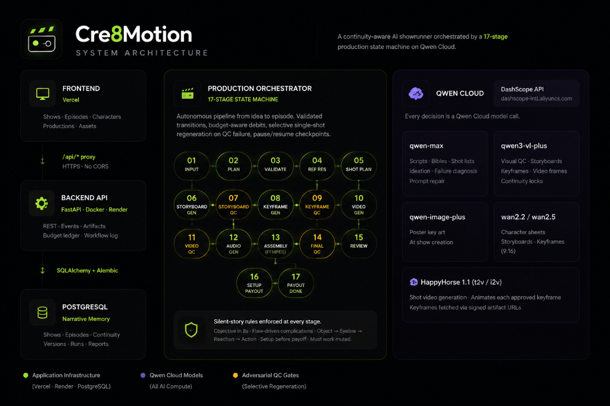

# cre8motion 🎬

**An AI Showrunner that autonomously produces short animated drama episodes — from a one-line premise to a finished, assembled video — built on Qwen Cloud.**

**Live demo:** https://cre8motion.vercel.app  
**API:** https://cre8motion.onrender.com/health  

Built for the Global AI Hackathon with Qwen Cloud — **Track 2: AI Showrunner**.

---

## System Architecture



A continuity-aware AI showrunner orchestrated by a **17-stage production state machine** on Qwen Cloud.

### 17-Stage Production Pipeline

```text
01 INPUT ──> 02 PLAN ──> 03 VALIDATE ──> 04 REF RES ──> 05 SHOT PLAN
                                                             │
10 VIDEO GEN <── 09 KEYFRAME QC <── 08 KEYFRAME GEN <── 07 STORYBOARD QC <── 06 STORYBOARD GEN
    │
11 VIDEO QC ──> 12 AUDIO GEN ──> 13 ASSEMBLY (FFMPEG) ──> 14 FINAL QC ──> 15 REVIEW ──> 16 SETUP PAYOUT ──> 17 PAYOUT DONE
```

* **Adversarial QC Gates (Stages 07, 09, 11, 14):** Visual quality control at every milestone. On failure, `qwen-max` diagnoses defects and repairs prompts for selective, single-shot regeneration.
* **Silent-Story Rules Enforced:** Objective in 8s · Flaw-driven complications · Object → Eyeline → Reaction → Action · Setup before payoff · Must work muted.

---

## What it does

You give cre8motion a show premise and characters. Its autonomous production pipeline then handles the entire creation process the way a real studio would — writing, planning, storyboarding, shooting, quality control, and editing — with no human in the loop (though you can pause and review at every stage):

1. **Script & episode planning** — story beats, pacing, and a full shot list
2. **Storyboards** — one frame per shot to lock composition
3. **Keyframes** — high-quality character-consistent stills
4. **Video generation** — each shot animated from its keyframe
5. **Automated QC** — a vision model reviews every artifact and triggers targeted retries with diagnosed fixes
6. **Audio & assembly** — sound cues and final episode stitching (`ffmpeg`)

---

## Qwen Cloud usage (proof for judges)

Every decision in the pipeline is a Qwen Cloud model call via the DashScope API (`dashscope-intl.aliyuncs.com`). All integration lives in **[`backend/app/providers/qwen.py`](backend/app/providers/qwen.py)**.

| Model | Purpose & Role |
|---|---|
| **`qwen-max`** | Scripts, Bibles, Shot lists, Ideation, Failure diagnosis, Prompt repair |
| **`qwen3-vl-plus`** | Visual QC (Storyboards, Keyframes, Video frames), Continuity locks |
| **`qwen-image-plus`** | Poster key art at show creation |
| **`wan2.2` / `wan2.5` / `wan2.7`** | Character sheets, Storyboards, Keyframes (9:16) |
| **`HappyHorse 1.1` (t2v / i2v)** | Shot video generation (animates each approved keyframe via signed artifact URLs) |

---

## Repository structure

| Folder | What it is |
|---|---|
| `frontend/` | React + Vite + TypeScript app (landing page + production workspace on Vercel) |
| `backend/` | FastAPI + SQLAlchemy + Alembic API and 17-stage state machine orchestrator (Docker on Render) |
| `docs/` | System architecture diagrams and technical documentation |
| `landing/` | Earlier standalone landing page (superseded — kept for reference) |

---

## Running locally

### Backend
```bash
cd backend
python -m venv venv
venv/Scripts/activate   # Windows (source venv/bin/activate on mac/linux)
pip install -r requirements.txt
cp .env.example .env    # add your QWEN_API_KEY
uvicorn app.main:app --reload
```

### Frontend
```bash
cd frontend
npm install
cp .env.example .env    # defaults point at http://localhost:8000/api
npm run dev
```

Set `DEMO_MODE=true` in the backend `.env` to run the full pipeline with deterministic local planning and placeholder media (no API costs).

---

## Deployment

- **Frontend** → Vercel (root: `frontend/`; `vercel.json` proxies `/api` and `/media` to the backend)
- **Backend** → Render, Docker (`backend/Dockerfile` runs Alembic migrations on boot)
- Required backend env vars: `QWEN_API_KEY`, `PUBLIC_API_BASE_URL`, `FRONTEND_ORIGINS`

---

## License

[MIT](LICENSE)
